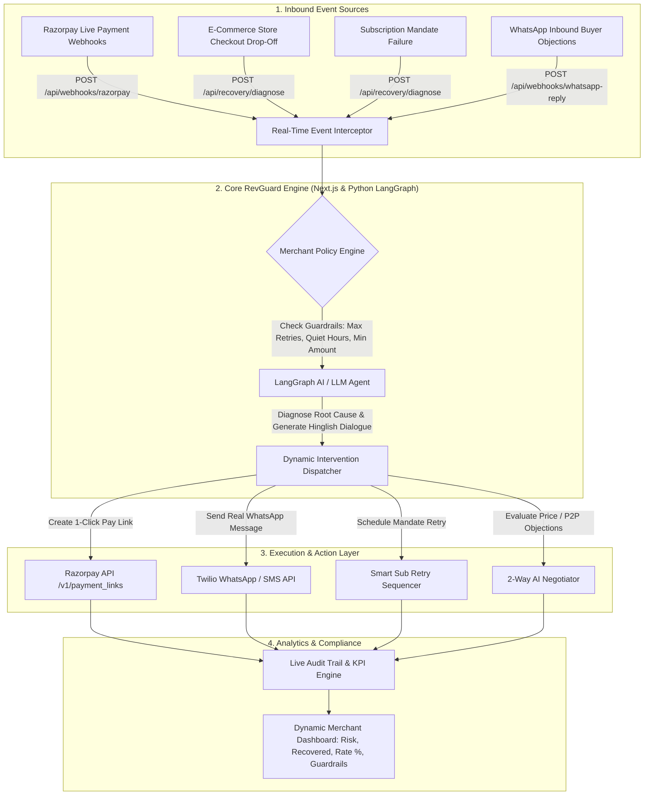

# 🛡️ RevGuard AI — Autonomous AI Revenue Recovery System

> **Razorpay Buildathon — Track 03: AI Revenue Recovery**  
> *Find revenue that’s slipping away and win it back autonomously.*

---

## 📖 Background of Current Systems & Problem Statement

### 🔍 The Current Industry Problem
In e-commerce and subscription businesses, revenue loss rarely happens in a single clean step. Up to **20% of total revenue is lost after a customer has already clicked "Pay Now"**. This revenue leaks continuously across four breakdown points:

1. **Payment Failures**: Bank OTP timeouts (`BAD_REQUEST_PAYMENT_TIMED_OUT`), insufficient funds, or gateway downtime.
2. **Checkout Drop-Offs**: Customers get hesitant on the payment page and abandon high-intent carts.
3. **Failed Subscriptions**: Recurring auto-debits fail on billing day due to bank server downtime or salary delays.
4. **Buyer Objections**: Buyers leave because they find the price slightly high or want to pay after payday, but nobody is negotiating with them live.

### 🛑 Why Existing Tools Fail
Most existing systems only send a static notification saying **"Payment failed"** or spam customers with generic SMS reminders. The merchant still has to manually figure out what happened, contact the customer, generate fresh links, and keep following up. This leads to customer frustration, high churn, and burnt retries.

---

## 💡 What RevGuard AI Solves

**RevGuard AI** turns revenue recovery from a manual follow-up process into a safe, measurable, autonomous system. It closes the entire recovery loop:

$$\text{Detect} \longrightarrow \text{Diagnose} \longrightarrow \text{Decide} \longrightarrow \text{Recover} \longrightarrow \text{Prove}$$

1. **Detect**: Intercepts payment failures, cart drop-offs, and mandate halts via real-time Razorpay webhooks.
2. **Diagnose**: Uses AI (Llama 3.3 70B via OpenRouter) to identify the technical or behavioral root cause.
3. **Decide**: Evaluates merchant policy rules before picking the optimal recovery action.
4. **Recover**: Executes multi-lingual (Hinglish) 1-click Razorpay payment links, smart retry schedules, or 2-way buyer negotiations.
5. **Prove**: Logs every action into an immutable audit trail displaying real-time money recovered and guardrail stopping rules enforced.

---

## 🏆 The Triple-Win Benefit

RevGuard AI creates a balanced value ecosystem across all three core stakeholders:

* **For Merchants**: Automatically wins back lost sales and boosts conversion rates while enforcing strict profit margin guardrails so discounts never compromise profitability.
* **For Razorpay**: Directly increases Gross Merchandise Value (GMV) and transaction processing volume by converting failed payment attempts into successful Razorpay payment links.
* **For Customers**: Delivers a respectful, 1-click checkout experience in their preferred language (Hinglish) while handling their price or timing concerns in real time.

---

## 🏗️ System Architecture Diagram



---

## 🚀 Recovery Modules

### 1️⃣ Module 1A & 1B: Payment Degradation & Cart Drop-Off Recovery
- **Real-Time Webhook Listener**: Captures bank OTP timeouts (`BAD_REQUEST_PAYMENT_TIMED_OUT`), insufficient funds, or gateway downtime with sub-50ms HMAC SHA-256 signature verification.
- **Cart Drop-Off Nudges**: Detects checkout abandonment (>40s hesitation) and dispatches 1-click Razorpay payment links via WhatsApp.

### 2️⃣ Module 2: Mandate Retry Sequencer (Subscriptions)
- **Smart Retries**: Intelligently delays recurring subscription debit retries (+4 hours / salary window) to avoid burning retries and incurring bank penalty fees.
- **Mandate Renewal Link**: Generates instant UPI AutoPe / mandate renewal links via WhatsApp.

### 3️⃣ Module 3: Dual-Sided 2-Way Hinglish Negotiator & P2P Tracker
- **Buyer Objection AI**: Handles real-time customer price negotiations (e.g., *"Too expensive! Can I get a 10% discount on Nykaa Matte Lipstick Box?"*).
- **Merchant Policy Enforcement**: Evaluates merchant rules; if allowed, dynamically recalculates order total (e.g., ₹2,499 → ₹2,249) and issues a discounted Razorpay payment link.
- **Promise-to-Pay (P2P) Tracker**: Logs salary-day payment commitments and automatically pauses aggressive reminders.

---

## 🛡️ Merchant Policy Engine & Guardrails
RevGuard AI operates strictly within bounded merchant parameters:
- **Max Retries Cap**: Automatically halts outreach after $N$ attempts to prevent customer annoyance.
- **Quiet Hours Enforcement**: Suppresses automated calls/messages between 9:00 PM and 8:00 AM (bypassed only in Flash Sale Mode).
- **Minimum Voice Threshold**: Directs high-value orders to Voice AI while keeping low-value orders on SMS/WhatsApp to optimize ROI.

---

## 📊 Live Metrics & Audit Trail ("The Bar")
- **Revenue at Risk (₹)**: Dynamically calculated total value of failed transactions.
- **Money Recovered (₹)**: Real-time track of successfully recovered revenue.
- **Recovery Rate (%)**: Live recovery efficiency ratio.
- **Stopping Rules Triggered (#)**: Count of interventions safely halted by Guardrail policies.
- **Immutable Audit Trail**: Detailed log recording timestamp, customer phone, diagnosis, action, explainability, and Razorpay Link ID.

---

## ⚡ Tech Stack & Integrations
- **Frontend & App Framework**: Next.js 16 (React 19, Tailwind CSS, Lucide Icons)
- **Payments Platform**: Razorpay APIs (`/v1/payment_links`)
- **Messaging Integration**: Twilio WhatsApp API & WhatsApp Web Deep Links
- **AI Agent Framework**: LangGraph / OpenRouter LLM Engine (Llama 3.3 70B)
- **Deployment & Tunnels**: Ngrok / Pinggy.io HTTP Tunneling

---

## 🛠️ Local Setup Instructions

1. **Clone & Install Dependencies**:
   ```bash
   git clone https://github.com/Mansi091/RevGuard-AI.git
   cd RevGuard-AI/revguard-app
   npm install
   ```

2. **Configure Environment Variables (`.env.local`)**:
   ```env
   RAZORPAY_KEY_ID=rzp_test_TYLJdxJMbSnP56
   RAZORPAY_KEY_SECRET=n3dBLBfZkoDB2l21gNfFK5OG
   RAZORPAY_WEBHOOK_SECRET=your_webhook_secret
   TWILIO_ACCOUNT_SID=your_twilio_sid
   TWILIO_AUTH_TOKEN=your_twilio_token
   OPENROUTER_API_KEY=your_openrouter_key
   ```

3. **Run Dev Server & Webhook Tunnel**:
   ```bash
   npm run dev
   # In another terminal:
   npx ngrok http 3000
   ```

4. **Access Dashboard**:
   Open [http://localhost:3000](http://localhost:3000) in your browser.

