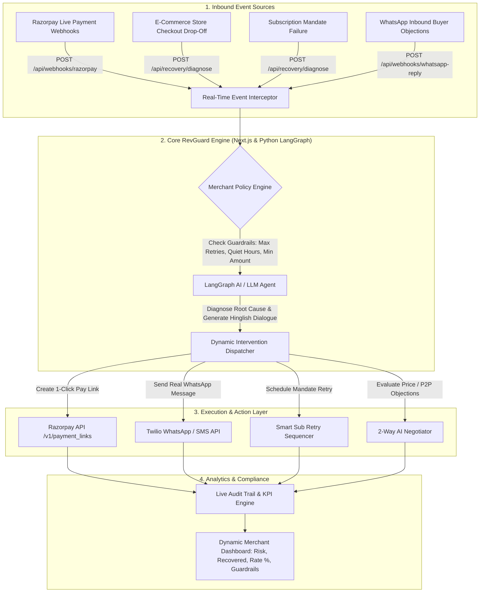

# 🛡️ RevGuard AI — Autonomous AI Revenue Recovery System

> **Razorpay Buildathon — Track 03: AI Revenue Recovery**  
> *Find revenue that’s slipping away and win it back autonomously.*

---

## 📌 Executive Summary
**RevGuard AI** is an autonomous, policy-bounded AI revenue recovery agent built for Razorpay merchants. It closes the loop from detecting payment degradation, cart drop-offs, and mandate failures to executing multi-lingual (Hinglish) 1-click WhatsApp/Voice recovery workflows with strict merchant policy guardrails and a real-time audit trail.

---

## 🏗️ System Architecture Diagram



---

## 🚀 Recovery Modules

### 1️⃣ Module 1A & 1B: Payment Degradation & Cart Drop-Off Recovery
- **Real-Time Webhook Listener**: Captures bank OTP timeouts (`BAD_REQUEST_PAYMENT_TIMED_OUT`), insufficient funds, or gateway downtime.
- **Cart Drop-Off Nudges**: Detects checkout abandonment (>40s hesitation) and dispatches 1-click Razorpay payment links via WhatsApp.

### 2️⃣ Module 2: Mandate Retry Sequencer (Subscriptions)
- **Smart Retries**: Intelligently delays recurring subscription debit retries (+4 hours / salary window) to avoid burning retries and incurring bank penalty fees.
- **Mandate Renewal Link**: Generates instant UPI AutoPe / mandate renewal links via WhatsApp.

### 3️⃣ Module 3: Dual-Sided 2-Way Hinglish Negotiator & P2P Tracker
- **Buyer Objection AI**: Handles real-time customer price negotiations (e.g., *"Too expensive! Can I get a 10% discount on Nykaa Matte Lipstick Box?"*).
- **Merchant Policy Enforcement**: Checks merchant rules; if allowed, dynamically recalculates order total and issues a discounted Razorpay payment link.
- **Promise-to-Pay (P2P) Tracker**: Logs salary-day payment commitments and automatically pauses aggressive reminders.

---

## 🛡️ Merchant Policy Engine & Guardrails
RevGuard AI operates strictly within bounded merchant parameters:
- **Max Retries Cap**: Automatically halts outreach after $N$ attempts to prevent customer annoyance.
- **Quiet Hours Enforcement**: Suppresses automated calls/messages between 9:00 PM and 8:00 AM (bypassed only in Flash Sale Mode).
- **Minimum Voice Threshold**: Directs high-value orders to Voice AI while keeping low-value orders on SMS/WhatsApp to optimize ROI.

---

## 📊 Live Metrics & Audit Trail ("The Bar")
- **Revenue at Risk (₹)**: Dynamically calculated total value of failed transactions.
- **Money Recovered (₹)**: Real-time track of successfully recovered revenue.
- **Recovery Rate (%)**: Live recovery efficiency ratio.
- **Stopping Rules Triggered (#)**: Count of interventions safely halted by Guardrail policies.
- **Immutable Audit Trail**: Detailed log recording timestamp, customer phone, diagnosis, action, explainability, and Razorpay Link ID.

---

## ⚡ Tech Stack & Integrations
- **Frontend & App Framework**: Next.js 16 (React 19, Tailwind CSS, Lucide Icons)
- **Payments Platform**: Razorpay APIs (`/v1/payment_links`)
- **Messaging Integration**: Twilio WhatsApp API & WhatsApp Web Deep Links
- **AI Agent Framework**: LangGraph / OpenRouter LLM Engine (Llama 3.3 70B)
- **Deployment & Tunnels**: Ngrok / Pinggy.io HTTP Tunneling

---

## 🛠️ Local Setup Instructions

1. **Clone & Install Dependencies**:
   ```bash
   git clone https://github.com/Mansi091/RevGuard-AI.git
   cd RevGuard-AI/revguard-app
   npm install
   ```

2. **Configure Environment Variables (`.env.local`)**:
   ```env
   RAZORPAY_KEY_ID=rzp_test_TYLJdxJMbSnP56
   RAZORPAY_KEY_SECRET=n3dBLBfZkoDB2l21gNfFK5OG
   RAZORPAY_WEBHOOK_SECRET=your_webhook_secret
   TWILIO_ACCOUNT_SID=your_twilio_sid
   TWILIO_AUTH_TOKEN=your_twilio_token
   OPENROUTER_API_KEY=your_openrouter_key
   ```

3. **Run Dev Server & Webhook Tunnel**:
   ```bash
   npm run dev
   # In another terminal:
   npx ngrok http 3000
   ```

4. **Access Dashboard**:
   Open [http://localhost:3000](http://localhost:3000) in your browser.

---

## 📜 License
Built for **Razorpay Buildathon 2026**. Open source under the MIT License.

